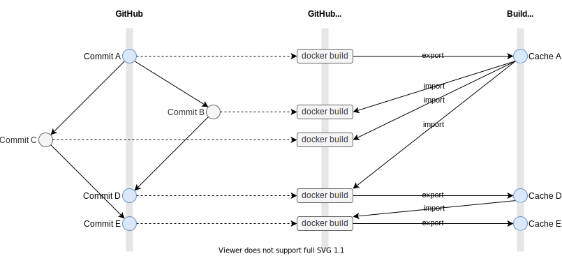

# docker-build-cache-config-action [](https://github.com/int128/docker-build-cache-config-action/actions/workflows/ts.yaml)

This is an action to generate `cache-from` and `cache-to` inputs of [docker/build-push-action](https://github.com/docker/build-push-action) for effective cache in pull request based development flow.


## Problem to solve

Docker BuildKit supports cache.
It imports and exports cache by the following parameters:

```yaml
cache-from: type=registry,ref=IMAGE
cache-to: type=registry,ref=IMAGE,mode=max
```

In pull request based development flow, cache is overwritten by pull requests and it causes cache miss.
For example,

1. Initially cache is set to `main` branch
1. When pull request B is opened,
    - Cache hit
    - Cache is overwritten to B
1. When pull request C is opened,
    - Cache miss
    - Cache is overwritten to C
1. When pull request B is merged into main,
    - Cache miss
    - Cache is overwritten to `main` branch


## Solution

This action generates effective cache config for pull request based development flow.
Basically,

- Cache always points to base branch
- Don't export cache on pull request

It would reduce time of docker build.




### `pull_request` event

When a pull request is opened, this action instructs docker/build-push-action to import cache of the base branch.
It does not export cache to prevent cache pollution.
For example,

```yaml
cache-from: type=registry,ref=IMAGE:main
cache-to:
```

### `push` event of branch

When a branch is pushed, this action instructs docker/build-push-action to import and export cache of the branch.
For example,

```yaml
cache-from: type=registry,ref=IMAGE:main
cache-to: type=registry,ref=IMAGE:main,mode=max
```

### `push` event of tag

When a tag is pushed, this action instructs docker/build-push-action to import cache of the default branch.
It does not export cache to prevent cache pollution.
For example,

```yaml
cache-from: type=registry,ref=IMAGE:main
cache-to:
```

### Others

Otherwise, this action instructs docker/build-push-action to import cache of the triggered branch.
It does not export cache to prevent cache pollution.
For example,

```yaml
cache-from: type=registry,ref=IMAGE:main
cache-to:
```


## Example

Here is an example to use cache on GHCR (GitHub Container Registry).

```yaml
      - uses: docker/metadata-action@v3
        id: metadata
        with:
          images: ghcr.io/${{ github.repository }}
      - uses: int128/docker-build-cache-config-action@v1
        id: cache
        with:
          image: ghcr.io/${{ github.repository }}/cache
      - uses: docker/build-push-action@v2
        id: build
        with:
          push: true
          tags: ${{ steps.metadata.outputs.tags }}
          labels: ${{ steps.metadata.outputs.labels }}
          cache-from: ${{ steps.cache.outputs.cache-from }}
          cache-to: ${{ steps.cache.outputs.cache-to }}
```

### For multi-architecture image

You can set a tag suffix to isolate caches.

```yaml
jobs:
  build:
    strategy:
      fail-fast: false
      matrix:
        platform:
          - linux/amd64
          - linux/arm64
    steps:
      - uses: docker/metadata-action@v3
        id: metadata
        with:
          images: ghcr.io/${{ github.repository }}
          flavor: suffix=-${{ matrix.platform }}
      - uses: int128/docker-build-cache-config-action@v1
        id: cache
        with:
          image: ghcr.io/${{ github.repository }}/cache
          flavor: suffix=-${{ matrix.platform }}
      - uses: docker/build-push-action@v2
        id: build
        with:
          push: true
          tags: ${{ steps.metadata.outputs.tags }}
          labels: ${{ steps.metadata.outputs.labels }}
          cache-from: ${{ steps.cache.outputs.cache-from }}
          cache-to: ${{ steps.cache.outputs.cache-to }}
          platforms: ${{ matrix.platform }}
```

### For monorepo

You can set a tag prefix to isolate caches.

```yaml
      - uses: docker/metadata-action@v3
        id: metadata
        with:
          images: ghcr.io/${{ github.repository }}/microservice-name
      - uses: int128/docker-build-cache-config-action@v1
        id: cache
        with:
          image: ghcr.io/${{ github.repository }}/cache
          flavor: prefix=microservice-name--
      - uses: docker/build-push-action@v2
        id: build
        with:
          push: true
          tags: ${{ steps.metadata.outputs.tags }}
          labels: ${{ steps.metadata.outputs.labels }}
          cache-from: ${{ steps.cache.outputs.cache-from }}
          cache-to: ${{ steps.cache.outputs.cache-to }}
```


## Specification

### Inputs

| Name | Default | Description
|------|----------|------------
| `image` | (required) | Image name to import/export cache
| `flavor` | ` ` | Flavor in form of `prefix=,suffix=`
| `tag-prefix` | ` ` | Prefix of tag (deprecated)
| `tag-suffix` | ` ` | Suffix of tag (deprecated)

`flavor` is mostly compatible with [docker/metadata-action](https://github.com/docker/metadata-action#flavor-input)
except this action supports only `prefix` and `suffix`.

### Outputs

| Name | Description
|------|------------
| `cache-from` | Parameter for docker/build-push-action
| `cache-to` | Parameter for docker/build-push-action
